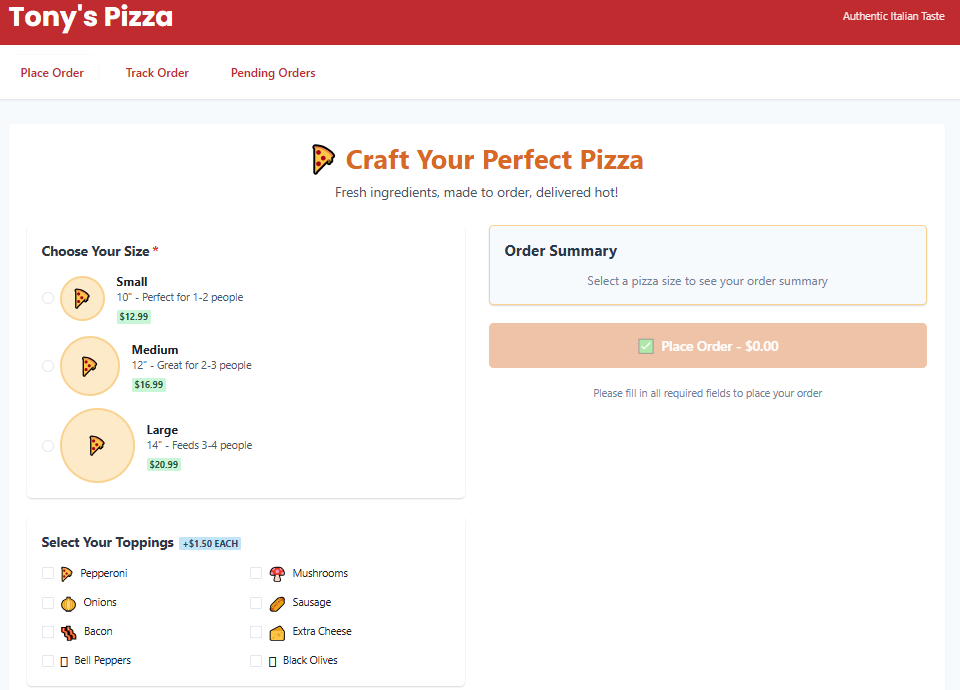
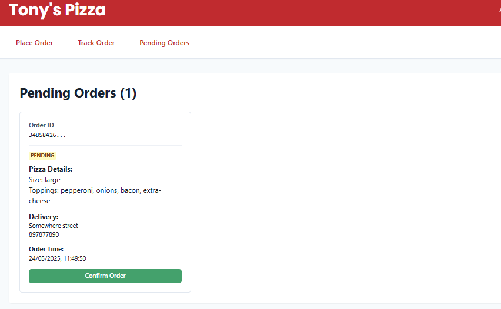
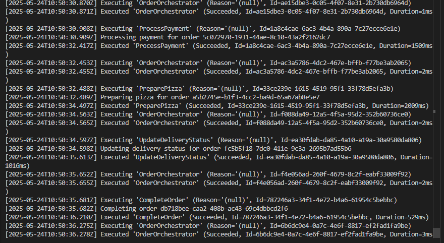

# Azure Durable Functions - Pizza Ordering System

[](https://github.com/tonyjoanes/azure-durable-functions/actions/workflows/build.yml)
[](https://dotnet.microsoft.com/download/dotnet/8.0)
[](https://nodejs.org/)
[](LICENSE)

This project demonstrates the use of Azure Durable Functions by implementing a pizza ordering system. The system showcases various features of Durable Functions including:
- Orchestration functions
- Activity functions
- Human interaction (approval steps)
- Error handling and retries
- State management

## Features

The pizza ordering system includes the following steps:
1. Order submission
2. Payment processing
3. Kitchen preparation
4. Delivery status updates
5. Order completion

## Prerequisites

- [.NET 6.0 SDK](https://dotnet.microsoft.com/download/dotnet/6.0)
- [Azure Functions Core Tools](https://docs.microsoft.com/en-us/azure/azure-functions/functions-run-local)
- [Azure Storage Emulator](https://docs.microsoft.com/en-us/azure/storage/common/storage-use-emulator) or [Azurite](https://github.com/Azure/Azurite)
- [Visual Studio 2022](https://visualstudio.microsoft.com/) or [Visual Studio Code](https://code.visualstudio.com/)
- [Node.js](https://nodejs.org/) (for the React frontend)

## Local Development Setup

1. Clone this repository
2. Install the prerequisites listed above
3. Start the Azure Storage Emulator or Azurite:
   - **Azurite (Cross-Platform):**
     - Install Azurite globally:
       ```bash
       npm install -g azurite
       ```
     - Run Azurite with the following command (adjust paths as needed):
       ```bash
       azurite --silent --location c:\azurite --debug c:\azurite\debug.log
       ```
   - **Azure Storage Emulator (Windows Only):**
     - Start the Azure Storage Emulator from the Start menu
4. Open the solution in your preferred IDE
5. Build the solution
6. Run the project locally using:
   ```bash
   func start
   ```

## Frontend Setup (React + Azure Functions)

This project includes a React frontend that communicates with Azure Functions. Here's how to set it up:

### Quick Start
1. **Start Azure Functions backend:**
   ```bash
   # In the root directory
   func start
   ```

2. **Start React frontend:**
   ```bash
   # In a separate terminal
   cd pizza-order-frontend
   npm install
   npm start
   ```

3. **Access the application:**
   - Frontend: http://localhost:3000
   - Backend API: http://localhost:7071

### Important Discovery: CORS Configuration

**Problem:** During development, we encountered persistent CORS issues when the React app (localhost:3000) tried to communicate with Azure Functions (localhost:7071).

**What Didn't Work:**
- React dev server proxy configurations (`"proxy": "http://localhost:7071"`)
- Custom `setupProxy.js` files with `http-proxy-middleware`
- Standalone Express proxy servers
- Various `host.json` CORS configurations

**The Solution:** Proper CORS configuration in `local.settings.json`

Configure CORS directly in Azure Functions by updating your `local.settings.json`:

```json
{
    "IsEncrypted": false,
    "Values": {
        "AzureWebJobsStorage": "UseDevelopmentStorage=true",
        "FUNCTIONS_WORKER_RUNTIME": "dotnet"
    },
    "Host": {
        "CORS": "*",
        "CORSCredentials": false
    }
}
```

**Why This Works:**
- ✅ Direct HTTP requests from React to Azure Functions
- ✅ No proxy complexity or timeout issues
- ✅ Proper CORS headers sent by Azure Functions
- ✅ Easy to debug and test endpoints directly

**Frontend Configuration:**
```typescript
// src/config.ts
const config = {
  apiBaseUrl: 'http://localhost:7071',  // Direct to Azure Functions
  apiEndpoints: {
    health: '/api/health',
    order: {
      create: '/api/OrderOrchestrator_HttpStart',
      status: (orderId: string) => `/api/OrderStatus/${orderId}`,
      confirm: (instanceId: string) => `/api/ConfirmOrder?instanceId=${instanceId}`
    }
  }
};
```

**Key Lesson:** For Azure Functions + React development, use direct CORS configuration rather than proxy servers. Proxies often introduce unnecessary complexity and timeout issues.

## Project Structure

- `PizzaOrderingSystem/` - Main project directory
  - `Functions/` - Contains all Azure Functions
    - `OrderOrchestrator.cs` - Main orchestration function
    - `HealthCheck.cs` - API health check endpoint
    - `PaymentActivity.cs` - Handles payment processing
    - `KitchenActivity.cs` - Manages pizza preparation
    - `DeliveryActivity.cs` - Handles delivery status
  - `Models/` - Data models
  - `Services/` - Business logic services
- `pizza-order-frontend/` - React frontend application
  - `src/components/` - React components
  - `src/config.ts` - API configuration
  - `package.json` - Frontend dependencies

## Testing the Application

1. Start the Azure Functions backend: `func start`
2. Start the React frontend: `cd pizza-order-frontend && npm start`
3. Access the web interface at http://localhost:3000
4. Use the health check endpoint to verify backend connectivity
5. Place orders through the web interface
6. Monitor orchestration progress in the Azure Functions console

## Next Steps

- [x] Set up project structure
- [x] Implement React frontend with health check
- [x] Solve CORS issues with proper configuration
- [ ] Implement basic order submission
- [ ] Add payment processing
- [ ] Create kitchen preparation workflow
- [ ] Implement delivery tracking
- [ ] Add human approval steps
- [x] Implement error handling and retries

## Screenshots

### Pizza Order Form

*Figure 1: The pizza order form lets users choose size, toppings, and delivery details.*

### Pending Orders

*Figure 2: Pending orders are shown with details and a confirmation button, demonstrating human-in-the-loop orchestration.*

### Orchestration Logs

*Figure 3: Logs show each orchestration step, including order submission, payment, pizza preparation, delivery update, and completion.*